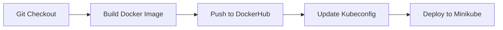

<div align="center">

# 🛍️ Trendstore

### A Modern E-Commerce Deployment on AWS EKS

[](https://jenkins.io)
[](https://hub.docker.com/r/sheershsinha/trendstore)
[](https://kubernetes.io)
[](https://www.terraform.io)
[](https://aws.amazon.com)

</div>

---

## 📖 About The Project

**Trendstore** is a scalable web application deployed on **Amazon Web Services (AWS)** using **Elastic Kubernetes Service (EKS)**. This repository contains the complete Infrastructure as Code (IaC), containerization logic, and CI/CD pipeline configurations required to deploy the application reliably and efficiently.

The application is served using **Nginx** inside a Docker container, orchestrated by Kubernetes, and the underlying infrastructure is provisioned using **Terraform**.

> **[📄 View Detailed Deployment Docs](https://docs.google.com/document/d/1XNmArDW61vSO9-JllvEgUAmOme0Nh3RT/edit?usp=drive_link&ouid=113314245151670066700&rtpof=true&sd=true)**

---

## 🛠️ Technology Stack

| Category | Technology | Description |
| :--- | :--- | :--- |
| **Containerization** |  | Container runtime for packaging the application. |
| **Orchestration** |  | Manages the deployment, scaling, and operations of application containers. |
| **Infrastructure** |  | Provisions the AWS VPC, EKS Cluster, and related resources. |
| **CI/CD** |  | Automates the build, test, and deployment pipeline. |
| **Cloud Provider** |  | Hosting environment (EKS, EC2, VPC). |
| **Web Server** |  | High-performance web server serving the static assets. |

---

## 🚀 CI/CD Pipeline

The project uses a **Jenkins** pipeline defined in `Jenkins/jenkinsfile` to automate the deployment process.



### Pipeline Stages:

1.  **Checkout Code**: Pulls the latest code from the `main` branch.
2.  **Build Docker Image**: Builds the image `ritikzilpe1630/trendstore-image` using the `Dockerfile`.
3.  **Login & Push**: Logs into DockerHub using credentials and pushes the image (tagged `v1` and `latest`).
4.  **Update Kubeconfig**: Authenticates with AWS and updates `kubeconfig` to interact with the `Trendstore-minikube` cluster in `us-east-2`.
5.  **Deploy to Minikube**: Applies the Kubernetes manifests:
    *   `deployment.yml`: Deploys the application pods.
    *   `service.yml`: Exposes the application via a Service.

---

## ⚙️ Setup & Deployment Instructions

### 1. Prerequisites

Ensure you have the following tools installed:
*   [AWS CLI](https://aws.amazon.com/cli/) (Configured with appropriate permissions)
*   [Terraform](https://www.terraform.io/downloads)
*   [Docker](https://www.docker.com/)
*   [kubectl](https://kubernetes.io/docs/tasks/tools/)

### 2. Infrastructure Provisioning (Terraform)

Navigate to the Terraform directory to provision the AWS EKS cluster.

```bash
cd Terraform
terraform init
terraform plan
terraform apply --auto-approve
```
*This will create the VPC, Subnets, Security Groups, and the EKS Cluster.*

### 3. Application Deployment (Manual)

If you want to deploy manually without Jenkins:

**Build & Push Image:**
```bash
docker build -t your-dockerhub-user/trendstore:latest .
docker push your-dockerhub-user/trendstore:latest
```

**Deploy to Kubernetes:**
Ensure your `kubectl` is configured for the EKS cluster:
```bash
aws eks update-kubeconfig --region us-east-2 --name Trendstore-Minikube
```

Apply the manifests:
```bash
cd Kubernetes
kubectl apply -f deployment.yml
kubectl apply -f service.yml
```

### 4. Jenkins Configuration

To use the automated pipeline, configure Jenkins with the following credentials:
*   **Token-02**: Username/Password credential for DockerHub.
*   **AWS Credentials**: Configure AWS credentials on the Jenkins agent or use IAM roles if running on EC2.

---

## 📂 Project Structure

```
Trendstore/
├── Jenkins/
│   └── jenkinsfile       # CI/CD Pipeline definition
├── Kubernetes/
│   ├── deployment.yml    # K8s Deployment manifest
│   └── service.yml       # K8s Service manifest
├── Terraform/
│   ├── main.tf           # Main Terraform configuration
│   ├── variables.tf      # Variable definitions
│   └── ...
├── dist/                 # Static application assets
├── dockerfile            # Docker image definition
└── Readme.md             # Project documentation
```

---

<div align="center">

Made with ❤️ by **Ritik Zilpe**

</div>
